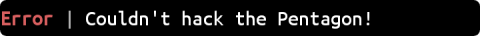

# Friendly CLI
Lightweight feature-rich Linux library, that written in modern C++17 and doesn't
require external dependencies.

## Text formatting
`Text` class provides text formatting tools, that support following specifiers.
- Style specifier `<s>`, where `s` is first lowercase letter of a style:
  **r**eset, **b**old, **u**nderline or **i**nverse.
- Foreground color specifier `~c~`, where `c` is first lowercase letter of
  a color: **r**ed, **g**reen, **y**ellow, **b**lue, **m**agenta, **c**yan or
  **d**im.
- Background color specifier `~C~`, where `C` is first uppercase letter of a
  color _(same list as above)_. By default, automatic foreground color inversion
  is enabled _(each color has its own rule)_, but if you want to turn it off use
  the exclamation mark `!` after a letter. Automatic inversion useful for colors
  that merge with the terminal text color.

To escape a specifier use the escape character `\033` before it.

Let's take a look at sample program.
```cpp
#include <iostream>
#include <string>

// Provides information about terminal abilities.
#include "fcli/terminal.hpp"
// Provides color palette.
#include "fcli/theme.hpp"
#include "fcli/text.hpp"

int main() {
  using namespace std;
  using namespace fcli;

  // How many colors terminal supports?
  const auto colors_support = Terminal().find_out_supported_colors();

  // Detection was successful?
  if (colors_support.has_value()) {
    // Save this information for text formatter.
    Terminal::cache_colors_support(*colors_support);
  } else {
    // Else we can ask user.
  }

  // Change current theme that used by formatter.
  Theme::set_theme(Theme::Name::ARCTIC_DARK);

  string text = "~m~Col~b~ori~c~ze<r> and <b><u>stylize<r> ~Y~anything<r>";
  Text::format(text);
  cout << text << endl;
  // Or pass text by value:
  // cout << Text::format_copy("...") << endl;
  return 0;
}
```
Execution result for a terminal that supports 256 colors:


`fcli::literals` namespace provides the user-defined string literals. For
example, to format an error message use the `_err` literal:
```cpp
cout << "Couldn't hack the Pentagon!"_err << endl;
```


## User-defined palette
If you don't like predefined themes, you can create own color palette:
```cpp
// Use the Material Light theme palette as base.
auto palette = Theme::get_palette(Theme::Name::MATERIAL_LIGHT);
// Change color properties.
palette.red = {160U, true};
// Apply new palette.
Theme::set_palette(palette);
```
Each color has two properties:
1. [8-bit color code](https://wikipedia.org/wiki/ANSI_escape_code#Colors);
2. Boolean value that determines whether foreground color should be inverted
   when using this color as background.

## Progress bar
Progress can be **undetermined** or **determined**. Undetermined progress has
animated indicator _(that you can change)_ and text:
```cpp
// false — progress isn't determined.
Progress progress("Calling Elon Musk", false);
progress.show();
```


Determined progress has percents and it shows loading bar as background color:
```cpp
// Reuse previously created progress.
progress.set_determimed(true);
// You can change text like this.
progress = "Downloading the Internet";
// And percents too.
progress = 42.0;
```


## Build
All you need is a compiler that supports the C++17 standard and default system
thread library. [doctest](https://github.com/onqtam/doctest) framework also
required if you want to build the unit tests (`BUILD_TESTING` option).
```
mkdir build
cd build
cmake .. -DBUILD_TESTING=<ON/OFF>
make
```
